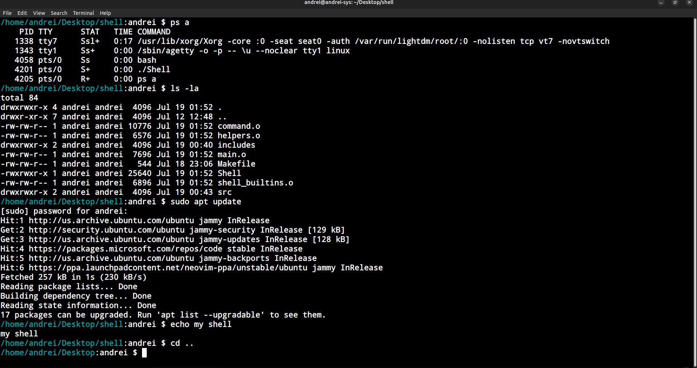

# My own shell written in C

This is a shell I wrote in C and has taught me about system calls and how to interact with the operating system, and not to mention how popular shells work (Bash, Fish, Zsh, etc). I utilized top down design and opaque object pattern in order to structure my code in a clean and easy to understand way. This shell has basic functionality but does not have more advanced features like pipes, IO redirection, shell scripting and so on, but that dosen't mean that those features will not come in the future.

## Upcoming features

- IO redirection
- Command piping
- Environment variable evaluation

